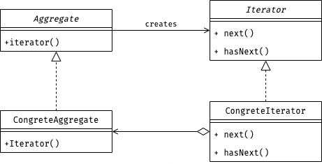

팀 내에서 디자인 패턴 스터디를 시작했다.

서로 디자인 패턴을 공부해오고 팀원들이 공부하며 파악한 이 패턴의 의도를 설명하는 형식으로 진행한다.
그리고 마지막으로는 멘토님께서 질문을 하며 여러 관점으로 제시해주신다.

첫 번째 스터디 때 한 Iterator Pattern에 관한 내용이다.
어떤 말이 오갔는지 정리했다.

# Iterator Pattern



- *Italic*체로 표기된 클래스는 Interface를 뜻한다.

## Iterator 패턴은 왜 쓸까?

- Aggregate의 구현과 상관없이 반환해주는 `iterator`만으로 사용할 수 있다.
  - 구현과 분리해서 하나씩 셀 수 있게 되었다.
  - Aggregate의 구현이 바뀌어도 클라이언트의 코드를 바꾸지 않아도 된다.
- Concrete 클래스만 사용시 결합이 강해져서 재사용이 어렵다.
- 복수의 `Iterator`를 통해 확장하기 좋다.
  - 하나의 ConcreteAggregate에 대해 여러 ConcreteIterator를 만들 수 있다.

## 질문

### Q1. How can interface create an interface?

UML 상에서 _Aggregate_ Interface가 _Iterator_ Interface를 구현한다고 표현했다.
인터페이스는 구현할 수가 없다. 그럼 이것이 의미하는 바가 무엇인가?

#### 주형 의견 - 관계를 물려받는 것을 표현한 것이다

> 흠.. 자식은 부모 클래스의 관계를 물려받는다.
> `ConcreteAggregate` 또한 `ConcreteIterator`를 create해야 한다는 것을 추상적으로 표현한 것 같다.

#### 정답 - 문법이다

```javascript
public interface Aggregate {
  public abstract Iterator iterator();
}
```

> 구체적인 코드로 생각하면 된다.
> Aggregate는 하나의 `iterator()`라는 추상 메서드가 있고 이것의 반환 타입이 *Iterator*인 것이다. 이것을 다이어그램으로 표현한 것이다.

### Q2. 처음부터가 아닌 중간의 Data만 참조하려면 어떻게 할 것인가?

#### Iterator는 *단순 반복자*라는 착각

> 원하는 데이터가 나올 때까지 `next()` 호출

처음부터 탐색을 한다면?

- 실제로 원하는걸 감지하는 것은 어려운 일이다.
- 클라이언트에게 보여주고 싶지 않은 데이터도 노출하게 된다.
- 비효율적이다.

#### 정답 - 새로운 Iterator를 생성한다

> 중간만 참조하는 iterator 만든다.

아까 설명했듯이 Iterator Pattern을 쓰면 원하는 방식으로 iterating할 수 있도록 복수의 iterator 생성할 수 있다.
중간만 참조하는 iterator를 반환하면 된다.

#### 응용 - Pub/Sub을 Iterator로 만든어보자

### Q3. Collection 원본을 index로 접근하면 되지 않은가?

Iterator 패턴 사용해서 추가적인 작업을 하는 것은 너무 소모적이지 않은가?

#### 주형 의견 - collection의 구현과 분리하기 위해서이다

틀린 대답이다.

Collection도 자료를 순회할 수 있도록 인터페이스를 제공한다.
모든 자료구조는 각자 추상 메서드가 존재한다. 최상위 클래스인 `Object`에 담아서 각각 indexing이 가능하다.

#### 정답 - 원본 데이터를 모두 노출하지 않아도 된다

어떤 것을 pulic하게 제공해주면 누가 어떻게 쓸지 모른다.
민감한 정보를 담은 collection이면 모든 데이터를 다 노출하고 싶지 않을 것이다.

##### 커스터마이징한 iterator

iterator를 커스터마이징해서 그 사용자가 봐야하는 데이터만 iterate할 수 있도록 제공해준다면 어떨끼?

iterator를 사용한다는 것은 누구나 잘 사용할 수 있도록 창구를 만드는 것이다.

##### 쓸데없는 복제 방지

이때 데이터를 복사하지 않고 관심있는 데이터로 jump해서 iterating할 수 있도록 인페이스를 제공하기 때문에 우리는 쓸데 없이 반복되는 데이터를 복사하지 않아도 된다.

즉, Iterator Pattern은 원본을 복제하지 않고 그 데이터를 지킬 수 있는 보안 패턴이다.

## 정리

### Iterator란?

#### 1. 내 원본 데이터를 지켜줄 보안 패턴

Iterator Pattern은 원본을 복제하지 않고 그 데이터를 지킬 수 있는 보안 패턴이다.

#### 2. 의사소통 도구이다

페턴은 공식이다.
글을 쓸 때는 기승전결이 있다. 코드의 기승전결을 패턴으로 만든 것이다.

##### 회사에서의 예상 시나리오

###### 패턴을 아는 사람

나:

> A는 Iterator 패턴으로 구현했어요

상대:
그럼 어그리게터는 누구에용?

나:
UserDataList입니다.

상대:
저는 UserDataList의 iterator를 받아서 사용만 하면 되겠군용!!

###### 모르는 사람

나:

> Iterator 패턴이 어울려서 이걸로 구현했어영

상대:

오옹 넹. 모르는 패턴이지만 찾아볼게요!

상대의 입장에서 좋은 점

- 기존의 알려진 패턴으로 작업했다는 점에서 안정감을 느낀다.
- 새로운 패턴을 알아가는 즐거움이 있다.
- 인터넷을 검색해서 보면 되기 때문에 의사소통이 간편한다.
