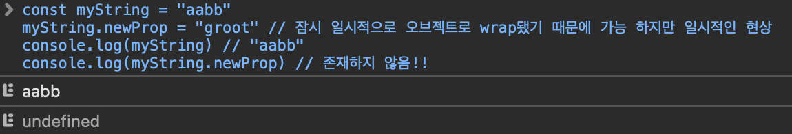

## Auto Boxing

### String is primitive

JS의 경우 원시형은 어떠한 속성도 가지고 있지 않다.
그리고 `string` 또한 원시형에 속한다.

```js
console.log('aa' === 'aa')
console.log(
  JSON.stringify({ name: juhyeong }) === JSON.stringify({ name: juhyeong })
)
```

다음과 같은 경우 모두 원시형이므로 값 비교를 해서 참이 나오는 것을 알 수 있다.

### string.length

원시형은 어떠한 프로퍼티도 가지고 있지 않다. 그냥 값 그 자체라고 한다.
그럼 아래의 결과가 어떻게 나올까?

```js
const myString = 'abc'
console.log(myString.length)
console.log(myString.toUpperCase())
```

```js
const myBool = true
console.log(myString.valueOf())
```

모두 마치 해당 프로퍼티가 있었다는 듯; 메서드가 다 정의되어 있었는 객체인양 잘 작동되고 오류도 나지 않는다.

> 왜 일까?

이것은 AutoBoxing때문이다.

### AutoBoxing

우리가 원시형으로 메서드를 호출하면 원시형은 자동으로 Wrapper Object에 wrapping된다. 잠시 여러 프로토타입 메서드를 가진 객체로 변신하는 것이다.

하지만 잠시 오브젝트로 바뀔뿐 원시형은 불변하므로 절대 변하지 않는다.
아래 코드를 보면 더 실감나게? 이해할 수 있다.

```js
const myString = 'aabb'
myString.newProp = 'groot' // 잠시 일시적으로 오브젝트로 wrap됐기 때문에 가능 하지만 일시적인 현상
console.log(myString) // "aabb"
console.log(myString.newProp) // 존재하지 않음!!
```


