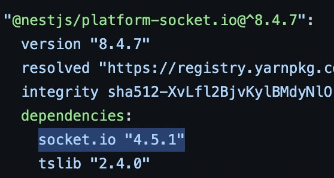

## Nest Adapter
Redis를 사용할 때 Nest에서 지원해주는 Adapter를 사용하려고 한다.

### 이유
Adapter Pattern을 사용하면 내가 어떤 라이브러리를 쓰든 호환이 된다.
똑같이 `WebSocketAdapter` interface를 통해 아무런 라이브러리나 쓸 수 있게 된다.

### Dependency
NestJS에서 Adapter를 이용해서 Redis를 사용하기 위해서 설치해야 되는 패키지는 딱 3가지다.
```
# npm을 쓰는 경우
npm i --save redis socket.io @socket.io/redis-adapter
# yarn을 쓰는 경우
yarn add redis socket.io @socket.io/redis-adapter
```


#### 1. redis
Redis client를 사용하기 위해 필요하다.

> "modern, high performance Redis client for Node.js."
>   - https://www.npmjs.com/package/redis


#### 2. socket.io
nodejs 서버도 만들 수 있고 웹 상에서 소켓통신을 할 때 크로스브라우징 같은 것을 신경 쓰지 않고 여러 편의 API를 사용하기 위해 필요하다.

> Socket.IO enables real-time bidirectional event-based communication
>  - https://www.npmjs.com/package/socket.io

나 같은 경우에는 예전에 `@nestjs/platform-socket.io`을 설치해서 이것의 dependency로 `socket.io`가 이미 깔려있었다.

#### 3. @socket.io/redis-adapter
Socket.IO Server에 기본적으로 내장되어 있는 어댑터를 확장해준다. 기본 어댑터의 브로드캐스트 함수를 확장한다.

> adapter extends the in-memory adapter that is included by default with the Socket.IO server.
>  - https://www.npmjs.com/package/@socket.io/redis-adapter

이 패키지를 설치할 때는 주의할 것이 있다. 
`Socket.IO`랑 **버전**을 맞춰줘야 한다.

[Compatibility Table](https://www.npmjs.com/package/@socket.io/redis-adapter#compatibility-table)을 참고해서 Socket.IO 버전에 맞는 것을 선택해서 설치하자.

나는 다른 패키지의 `socket.io`가 dependency로 깔려서 버전을 `package.json`에서 확인할 수 없었고 lock 파일에서 `socket.io`의 버전을 확인할 수 있었다. 


나는 `yarn`을 써서 yarn.lock을 확인해본 결과 아래와 같았다.



위에 보시다시피 `socket.io` "4.5.1"로 최신 redis-apdapter 패키지와 호환돼서 최신 버전을 깔았다.


### 주의할 점
다른 블로그 글을 읽다보면 똑같은걸 쓰는 것 같은데 깔아주는게 더 많거나 다른 것을 깔아준다. 
그런 것들을 조금 정리해보고자 한다.

#### @types/socket.io
원래 stub type definition을 위해 쓰던 것이다.
현재 deprecated된 상태이다.
`socket.io`가 자체적으로 타입 정의를 해줘서 이제 필요 없다.


#### socket.io-redis
`@socket.io/redis-adapter`로 이름이 바뀐 것이다. 

v7부터 관련된 패키지(`@socket.io/redis-emitter`)와 이름명을 바꿔주기 위해 패키지명만 바꿨다고 한다. 
아직 통신 프로토콜은 같기 때문에 `@socket.io/redis-adapter`랑 같이 사용해도 상관 없다.


## 출처
 - https://docs.nestjs.com/websockets/adapter
